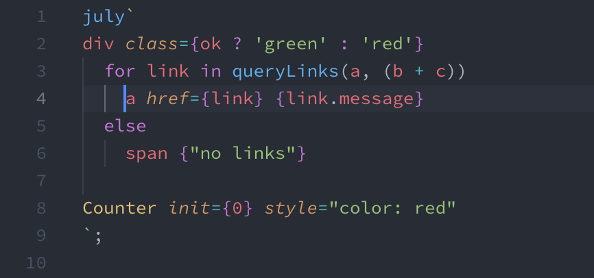

# July

Yet another template engine, it can be used as an alternative solution of [JSX](https://github.com/facebook/jsx).

It's inspired by [Pug](https://github.com/pugjs/pug) and JSX to provide more clean and flexible syntax.

The XML-like syntax such as JSX, although is easy to understand but can not be directly parsed by eyes, we still need the code formatters and syntax highlighters to enhance the development experience. 

The nature of this problem is that if the XML-like syntax is well-formatted, those `<`, `>` and closing tags is verbose, keep them in code just slow down our eye-parsing. July prefers to use the `Pug` syntax to express the tags and their hierarchical structures, because it remove the verbose items therefore brings more clear syntax, besides, it uses indents to express the hierarchical structures, this also force the code is always well-formatted.

JSX does not include the `for` and `if` statements, despite there maybe deep meaning behind this behavior, control flows are flexible and useful at sometimes. July provides them out-of-box.
 
It's in development, stay tuned.
